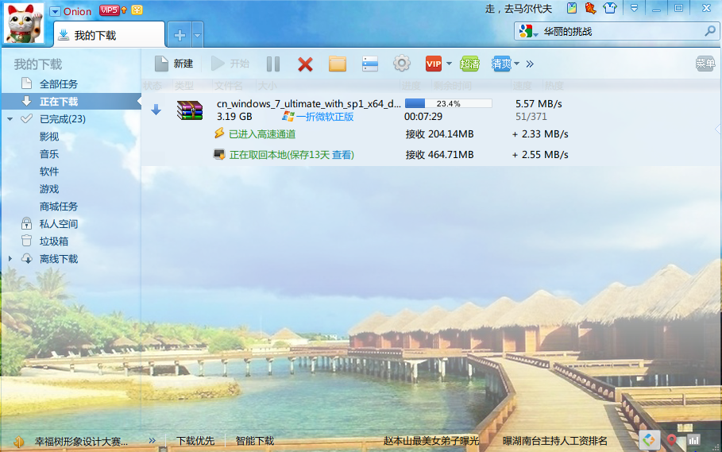

# My Awesome Book

This file serves as your book's preface, a great place to describe your book's content and ideas.
# 中文测试

```php
<?php

echo file_get_contents();

class a {
  public function google() {
     echo "www.google.com";
     //这是一个错误的例子
  }

}
```

